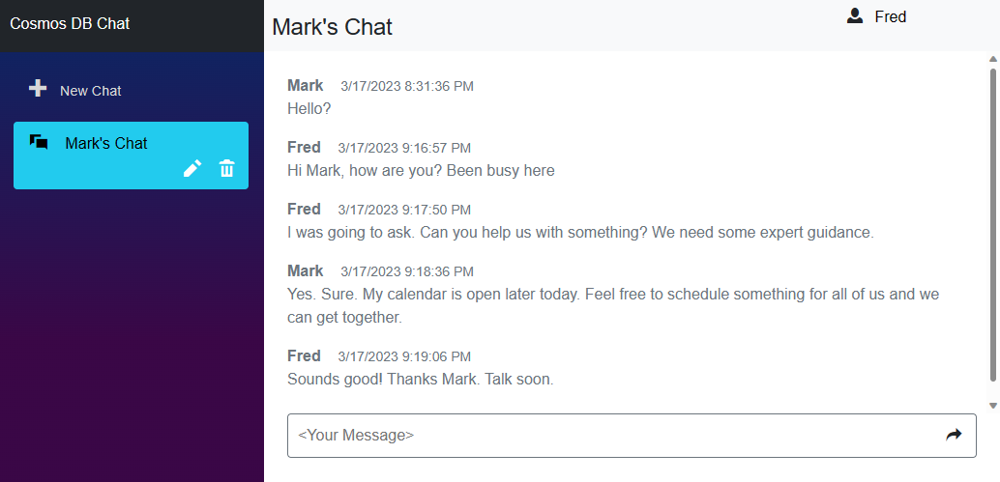

# Azure Cosmos DB Chat Sample Reference Application

This is a sample application that combines Azure Cosmos DB, Azure App Service with ASP.NET Core Blazor Server, to provide a simple chat application.

This application was built using:
- Azure Cosmos DB
- Azure App Service 
- ASP.NET Core Blazor

## Features

This application has support for multiple chat sessions. These are displayed and can be selected in the left-hand nav of the application. Clicking on a session will show the messages for that chat session. Users can rename or delete chat sessions. To type into a chat the user must type a name in the box in the upper right corner.

The history for all chats are stored in Azure Cosmos DB. Deleting a chat session in the app will delete all messages for that chat. When the user clicks on a chat session, the application will initially return the first 100 messages in that chat. As the user scrolls back, the application will fetch additional chat messages, 100 at a time. 

Please note this is a sample application. It is intended to demonstrate a use case for Azure Cosmos DB and Azure App Services. It is not intended to be used as-is for production or other large scale use.

### Prerequisites

- Azure Subscription
- Visual Studio, VS Code, or some editor if you want to edit or view the source for this sample.

### Installation

1. Fork this repository to your own GitHub account.
1. Modify this variable, "webSiteRepository": "https://github.com/AzureCosmosDB/cosmos-chat.git" in either the ARM or Bicep Template to point to your fork of this repository.
1. If using the Deploy to Azure button below, also modify this README.md file to change the path for the Deploy To Azure button to your local repository.
1. If you deploy this application without making either of these changes, you can update the repository by disconnecting and connecting an external git repository pointing to your fork.

### Service Deployment
The provided ARM or Bicep Template will provision the following resources:
1. Azure Cosmos DB account with database and container at 400 RU/s. This can optionally be configured to run on the Cosmos DB free tier if available for your subscription.
1. Azure App service. This will be configured for CI/CD to your forked GitHub repository. This service can also be configured to run on App Service free tier.

All connection information for Azure Cosmos DB is injected as environment variables in the Azure App Service instance at deployment time for a zero-touch deployment.

### Quickstart

1. After deployment, go to the resource group for your deployment and open the Azure App Service. Click the web url to launch the website.
1. Click + New Chat to create a new chat session.
1. Type your name in the upper right hand corner of the application.
1. Type messages into the chat.

## Clean up

To remove all the resources used by this sample delete the resource group for your deployment.

## Resources

- [Azure Cosmos DB Free Trial](https://aka.ms/TryCosmos)
- [Azure Cosmos DB Documentation](https://learn.microsoft.com/azure/cosmos-db/)
- [Azure App Service Documentation](https://learn.microsoft.com/azure/app-service/)
- [ASP.NET Core Blazor Documentation](https://learn.microsoft.com/aspnet/core/blazor/)
