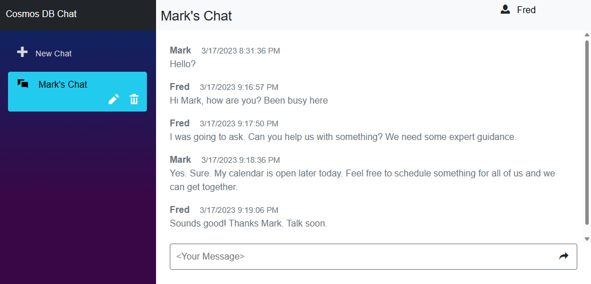

# Azure Cosmos DB Chat Sample Reference Application

This is a sample application that combines Azure Cosmos DB with ASP.NET Blazor Server, to provide a simple chat application. 

This application can be run locally without an Azure subscription using an [Azure Cosmos DB Free Trial Account](https://aka.ms/trycosmosdbchatconversion). This can also be deployed to Azure App Service with an Azure subscription.

This application was built using:
- Azure Cosmos DB
- ASP.NET Blazor Server

## Features

This application has support for multiple chat sessions. These are displayed in the left-hand nav of the application. Clicking on a session will show the messages for that chat session. Users can rename or delete chat sessions. To type into a chat, provide a user name in the upper right corner.

The history for all sessions and chats are stored in Azure Cosmos DB. Deleting a chat session in the app will delete all messages for that chat. When the user clicks on a chat session, the application will initially return the first 100 messages in that chat. As the user scrolls back, the application will fetch additional chat messages, 100 at a time. 

Please note this is a sample application. It is intended to demonstrate a use case for Azure Cosmos DB and Azure App Services. It is not intended to be used as-is for production or other large scale use.

### Prerequisites

- A [Try Cosmos DB Account](https://aka.ms/trycosmosdbchatconversion)
- An editor with debugging support, Visual Studio, VS Code, or some editor if you want to edit or view the source for this sample.

### Installation

1. Create a trial Azure Cosmos DB account at https://aka.ms/trycosmosdbchatconversion 
1. [Fork this repository](https://github.com/AzureCosmosDB/cosmos-chat/fork) to your own GitHub account and/or clone locally.
1. Open appsettings.json and enter the endpoint and key to your trial Cosmos DB account.

### Running

1. After installation steps, go to your IDE and launch the application.
1. Click + New Chat to create a new chat session.
1. Type your name in the upper right hand corner of the application.
1. Type messages into the chat.

## Resources

- [Azure Cosmos DB Free Trial](https://aka.ms/trycosmosdbchatconversion)
- [Azure Cosmos DB Documentation](https://learn.microsoft.com/azure/cosmos-db/)
- [Azure App Service Documentation](https://learn.microsoft.com/azure/app-service/)
- [ASP.NET Core Blazor Documentation](https://learn.microsoft.com/aspnet/core/blazor/)
